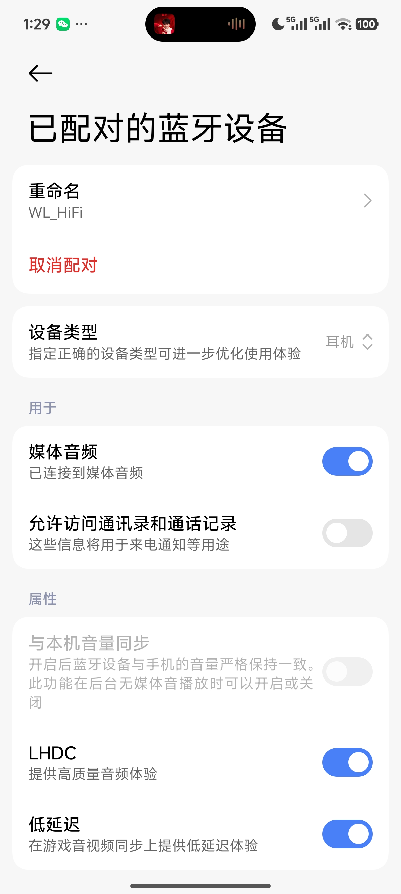

# liblhdc-collections

Collected lhdc libs from any platform.

## 1. Savitech LHDC Codec for AOSP

LHDC（包含LHDCV5）是[Savitech LHDC](https://lhdc.co/cn)发行的编解码技术，其最新开源内容可访问[
Savitech LHDC Codec for AOSP](https://gitlab.com/savitech-lhdc)获取。LHDC是用于最高质量无线音频的下一代技术。 LHDC 能大幅降低无线与有线音频设备之间的音频质量差异，提供最逼真的超高音质，让用户能尽情享受蓝牙无线音频带来的便利性和高质量。适用于视频、音乐和游戏等所有应用。以漫步者花再 Halo Space 体验为例，最新的LHDCV5(192kHz & 24bit)在实际体验上已经优于LDAC(96kHz & 32bit)。

目前，大多数优于SBC的A2DP codec算法，比如LDAC、AAC、OPUS、LC3、aptX[L/HD]、LHDC V5，都均已开源；其中关于LHDC V5， `WillyBilly06` 开源了 LHDC V5 解码器（[WillyBilly06/LHDC-V5-Decoder](https://github.com/WillyBilly06/LHDC-V5-Decoder)），同时 `Google` 开源了 lhdcv5 编码器（[lhdcv5](https://android.googlesource.com/platform/packages/modules/Bluetooth/+/refs/heads/android17-release/system/audio/codecs/lhdcv5)）。

> 要实现LHDC编解码，在没有源码的情况下,需要使用独立于项目的第三方库；大多数耳机用的是Savitech LHDC的".a"格式的静态库，而Android用的是Savitech LHDC的".so"格式的动态库；“.a”静态库通常伴随着BES等项目的SDK提供，“.so”动态库在支持LHDC的手机中可轻易找到。

### 1.1 Test of LHDC-V5-Decoder on ESP32

对 `LHDC-V5-Decoder` 的测试效果如下，SEP注册、CAP协商、解码都没有问题：
```
I (1664) BTDM_INIT: BT controller compile version [1175e0a]
I (1664) BTDM_INIT: Bluetooth MAC: 00:70:07:e1:cb:de
I (1674) phy_init: phy_version 4791,2c4672b,Dec 20 2023,16:06:06
I (2094) main_task: Returned from app_main()
W (2104) BT_BTC: A2DP Enable with AVRC
I (2114) BT_LOG: A2DP_BuildInfoLhdcV5: MT:0x{00}, VID:0x{0000053a}, CID:0x{4c35}, SR:0x{35}, BPS:0x{07}, CM:0x{01}, Ver:0x{01}, FL:0x{10}, MBR:0x{00}, mBR:0x{00}
I (2114) BT_LOG: A2DP_BuildInfoLhdcV5: codec info built = H0-H2:0x{0d} 0x{00} 0x{ff} P0-P3:0x{3a} 0x{05} 0x{00} 0x{00} P4-P5:0x{35} 0x{4c} P6:0x{35} P7:0x{07} P8:0x{11} P9:0x{40} P10:0x{00}
I (2134) BT_AV: A2DP PROF STATE: Init Complete
I (2134) BT_AV: event: 10
I (2144) BT_AV: event: 10
I (2144) BT_AV: event: 10
I (2154) BT_AV: event: 10
I (2154) BT_AV: Get delay report value: delay_value: 1200 * 1/10 ms
I (2164) BT_AV: Set delay report value: success, delay_value: 1250 * 1/10 ms
W (14464) BT_HCI: hcif conn complete: hdl 0x80, st 0x0
I (14464) BT_AV: ESP_BT_GAP_ACL_CONN_CMPL_STAT_EVT Connected to [3c:38:24:5c:4a:cf], status: 0x100
W (14504) BT_HCI: hcif link supv_to changed: hdl 0x80, supv_to 8000
I (14944) BT_AV: A2DP connection state: Connecting, [3c:38:24:5c:4a:cf]
I (14944) AUDIO_OUTPUT_I2S: I2S output started
I (15104) BT_LOG: A2DP_ParseInfoLhdcV5: codec info parsed = H0-H2:0x{0d} 0x{00} 0x{ff} P0-P3:0x{3a} 0x{05} 0x{00} 0x{00} P4-P5:0x{35} 0x{4c} P6:0x{10} P7:0x{02} P8:0x{11} P9:0x{00} P10:0x{00}
I (15114) BT_LOG: A2DP_ParseInfoLhdcV5:  isCap{SNK} SR:0x{01} BPS:0x{10} CM:0x{02} Ver:0x{01} FL:0x{01} MBR:0x{10} mBR:0x{00} FeatureAR({0}) JAS({0}) META({0}) LL({0}) LLESS({0}) LLESS24({0}) LLESS96K({0}) LLESSRaw({0})
I (15134) BT_LOG: A2DP_ParseInfoLhdcV5: codec info parsed = H0-H2:0x{0d} 0x{00} 0x{ff} P0-P3:0x{3a} 0x{05} 0x{00} 0x{00} P4-P5:0x{35} 0x{4c} P6:0x{10} P7:0x{02} P8:0x{11} P9:0x{00} P10:0x{00}
I (15144) BT_LOG: A2DP_ParseInfoLhdcV5:  isCap{SNK} SR:0x{01} BPS:0x{10} CM:0x{02} Ver:0x{01} FL:0x{01} MBR:0x{10} mBR:0x{00} FeatureAR({0}) JAS({0}) META({0}) LL({0}) LLESS({0}) LLESS24({0}) LLESS96K({0}) LLESSRaw({0})
I (15174) BT_AV: A2DP audio stream configuration, codec type: 255
I (15174) BT_LOG: A2DP_ParseInfoLhdcV5: codec info parsed = H0-H2:0x{0d} 0x{00} 0x{ff} P0-P3:0x{3a} 0x{05} 0x{00} 0x{00} P4-P5:0x{35} 0x{4c} P6:0x{10} P7:0x{02} P8:0x{11} P9:0x{00} P10:0x{00}
I (15174) CODEC_CONFIG: a2dp audio_cfg_cb , codec type 255
W (15194) BT_APPL: new conn_srvc id:19, app_id:0
I (15194) BT_LOG: A2DP_ParseInfoLhdcV5:  isCap{SNK} SR:0x{00} BPS:0x{10} CM:0x{02} Ver:0x{01} FL:0x{01} MBR:0x{10} mBR:0x{00} FeatureAR({0}) JAS({0}) META({0}) LL({0}) LLESS({0}) LLESS24({0}) LLESS96K({0}) LLESSRaw({0})
I (15204) CODEC_CONFIG: get_codec_config: Configure audio player 3a-5-0-0-35-4c
I (15224) BT_LOG: A2DP_ParseInfoLhdcV5: codec info parsed = H0-H2:0x{0d} 0x{00} 0x{ff} P0-P3:0x{3a} 0x{05} 0x{00} 0x{00} P4-P5:0x{35} 0x{4c} P6:0x{10} P7:0x{02} P8:0x{11} P9:0x{00} P10:0x{00}
I (15234) CODEC_CONFIG: get_codec_config: configure LHDCV5 codec
I (15254) BT_LOG: A2DP_ParseInfoLhdcV5:  isCap{SNK} SR:0x{00} BPS:0x{10} CM:0x{02} Ver:0x{01} FL:0x{01} MBR:0x{10} mBR:0x{00} FeatureAR({0}) JAS({0}) META({0}) LL({0}) LLESS({0}) LLESS24({0}) LLESS96K({0}) LLESSRaw({0})
I (15254) BT_AV: A2DP audio stream configuration, codec name: LHDC V5
I (15274) LHDCV5_DEC: configure: workspace 32544 bytes (sized for 192k; rate=48000)
I (15284) AUDIO_OUTPUT_I2S: I2S output stopped
I (15294) LHDCV5_DEC: IMDCT self-test: fast=ENABLED maxref=4166.6 maxdiff=0.241
I (15294) AUDIO_OUTPUT_I2S: Configure I2S: 48000Hz | 2ch | 32bit | I2S_STD_FORMAT
I (15304) LHDCV5_DEC: decoder configured: sr=48000 depth=24 ch=2 dur=5
I (15314) AUDIO_OUTPUT_I2S: I2S configured: 48000Hz | 32bit | 2ch | I2S_STD_FORMAT
I (15324) BT_AV: protocol service capabilities configured: 0x1 
I (15334) BT_AV: Peer device support delay reporting
I (15344) BT_AV: A2DP connection state: Connected, [3c:38:24:5c:4a:cf]
I (15344) AUDIO_OUTPUT_I2S: I2S output started
I (15434) RC_CT: AVRC conn_state event: state 1, [3c:38:24:5c:4a:cf]
I (15434) RC_TG: AVRC conn_state evt: state 1, [3c:38:24:5c:4a:cf]
I (15434) RC_CT: AVRC remote features 24b, TG features 11
I (15444) RC_TG: AVRC remote features: 24b, CT features: 2
I (15454) RC_CT: remote rn_cap: count 8, bitmask 0x1f26
I (15504) RC_CT: AVRC metadata rsp: attribute id 0x1, 如今走过这世间
I (15504) RC_CT: AVRC metadata rsp: attribute id 0x2, 周深-起风了
I (15504) RC_CT: AVRC metadata rsp: attribute id 0x4, 起风了
I (15514) RC_CT: AVRC metadata rsp: attribute id 0x20, Unavailable
W (18404) BT_HCI: hci cmd send: sniff: hdl 0x80, intv(400 800)
W (18514) BT_HCI: hcif mode change: hdl 0x80, mode 2, intv 768, status 0x0
I (18514) BT_AV: ESP_BT_GAP_MODE_CHG_EVT mode: 2
W (20474) BT_HCI: hcif mode change: hdl 0x80, mode 0, intv 0, status 0x0
I (20474) BT_AV: ESP_BT_GAP_MODE_CHG_EVT mode: 0
I (20474) RC_CT: AVRC event notification: 1
I (20474) BT_LOG: bta_av_link_role_ok hndl:x41 role:1 conn_audio:x1 bits:1 features:x864b

I (20474) BT_AV: Playback status changed: 0x1
W (20484) BT_APPL: new conn_srvc id:19, app_id:1
I (20494) BT_AV: A2DP audio state: Started
I (20504) RC_CT: AVRC event notification: 5
I (20504) BT_AV: Play position changed: 151514-ms
I (20634) AUDIO_OUTPUT_I2S: ringbuffer data increased! mode changed: RINGBUFFER_MODE_PROCESSING
I (21064) BT_AV: Audio packet count: 100
I (21564) BT_AV: Audio packet count: 200
I (21564) RC_CT: AVRC event notification: 5
I (21564) BT_AV: Play position changed: 152644-ms
I (22064) BT_AV: Audio packet count: 300
I (22304) RC_CT: AVRC event notification: 5
I (22304) BT_AV: Play position changed: 153382-ms
I (22364) RC_CT: AVRC event notification: 2
I (22404) RC_CT: AVRC metadata rsp: attribute id 0x1, 万般流连
I (22404) RC_CT: AVRC metadata rsp: attribute id 0x2, 周深-起风了
I (22404) RC_CT: AVRC metadata rsp: attribute id 0x4, 起风了
I (22414) RC_CT: AVRC metadata rsp: attribute id 0x20, Unavailable
I (22564) BT_AV: Audio packet count: 400
I (23084) BT_AV: Audio packet count: 500
I (23404) RC_CT: AVRC event notification: 5
I (23404) BT_AV: Play position changed: 154483-ms
I (23564) BT_AV: Audio packet count: 600
I (24064) BT_AV: Audio packet count: 700
I (24094) RC_CT: AVRC event notification: 5
I (24094) BT_AV: Play position changed: 155151-ms
I (24194) RC_CT: AVRC event notification: 2
I (24264) RC_CT: AVRC metadata rsp: attribute id 0x1, 翻过岁月不同侧脸
I (24264) RC_CT: AVRC metadata rsp: attribute id 0x2, 周深-起风了
I (24274) RC_CT: AVRC metadata rsp: attribute id 0x4, 起风了
I (24274) RC_CT: AVRC metadata rsp: attribute id 0x20, Unavailable
I (24564) BT_AV: Audio packet count: 800
I (25064) BT_AV: Audio packet count: 900
I (25264) RC_CT: AVRC event notification: 5
```



### 1.2 测试遇到的问题：
- 解码器初始化失败[√]：需要足够的PSRAM，需要设置 `CONFIG_SPIRAM_USE_MALLOC=y`，问题可解决；
- 间歇性的 `buffer overflow` [√]：设置 `components/bt/host/bluedroid/btc/profile/std/a2dp/btc_a2dp_sink.c` 里的 `BT_A2DP_SINK_BUF_SIZE` 不低于 `16384` ，问题可解决；
- 播放音乐期间会短时失速并加速[×]：原因未知;
- 长时间播放（超过12小时）出现pop[×]：次数一次，暂停后稍等再播放，故障消失，原因未知；
- 切换 `采样率/位深` ，会没声音[×]：Source端切换参数，Sink端可捕获到 `hcif mode chang` ，分析 `audio_cfg_cb` 确实是Source采用的参数，继续播放音乐，能看见不断增加的 `Audio packet count` ，但是LHDC V5解码器会失去声音，原因未知；

---

## 2. 本仓库有什么？

| Project | 属性 | 简介 |
|---------|-----|------|
| LHDC-V5-Decoder | LHDC V5 Decoder | 由 [WillyBilly06](https://github.com/WillyBilly06) 从零开始构建的LHDC V5解码器源码，我已在 ESP32 验证其真实有效且足够稳定。据观测，这是开源的第一份功能有效的LHDC V5解码器。最新内容请访问：[WillyBilly06/LHDC-V5-Decoder](https://github.com/WillyBilly06/LHDC-V5-Decoder) |
| lhdcv5 | LHDC V5 Encoder | 由Google开源的LHDC V5 编码器，由Rust编写，适用于Android 17，暂未验证可行性。正常来说，可以逆向为C格式的编解码器。据观测，这是开源的第一份内容较为完整的LHDC V5编码器。最新内容请访问：[lhdcv5](https://android.googlesource.com/platform/packages/modules/Bluetooth/+/refs/heads/android17-release/system/audio/codecs/lhdcv5) |
| BES-IHC | 包含.a格式静态库 | 适用于BES的LHDC[V5]库，包含.a静态库和头文件，完整SDK详见[audio_prj_collections](https://github.com/sprlightning/audio_prj_collections) |
| AOSP | 包含.so动态库 | 适用于AOSP的的LHDC[V5]库，就decoder而言，除了无解码算法源文件（lhdcv5_util_dec.c），其余源文件及头文件是完整的；此外也包含提取自XIAOMI HyperOS 2.0.211.0的".so"动态库 |
| ESP-IDF | ESP-IDF Integration | 包含适用于ESP-IDF的移植版[liblhdcv5dec](https://github.com/sprlightning/liblhdcv5dec)和lhdcv5 decoder，均具备完整的源文件和头文件，均移植于AOSP，使用LHDCV5协商后，可听到正弦波生成的标准音；其中lhdcv5_util_dec.c仅具备解码函数占位的作用，仅供参考 |

---

## 3. LHDCV5解码原理

如前面所说， `WillyBilly06` 开源了 LHDC V5 解码器（[WillyBilly06/LHDC-V5-Decoder](https://github.com/WillyBilly06/LHDC-V5-Decoder)），同时 `Google` 开源了 lhdcv5 编码器（[lhdcv5](https://android.googlesource.com/platform/packages/modules/Bluetooth/+/refs/heads/android17-release/system/audio/codecs/lhdcv5)）。

这里就不废话了，分析 `WillyBilly06` 的 `LHDC-V5-Decoder`可知LHDC V5解码原理如下：

### 3.1 整体流程概览

LHDC V5 的解码流程可划分为以下阶段：

```
A2DP 包 -> 解包/帧重组 -> [u16 LE 帧头 + payload] -> 每声道独立解码
                                                    -> 解扰 (descramble)
                                                    -> 读取前端参数 (gain/SNS/nzc/flag2/resid)
                                                    -> FAC 熵解码 (stream1 + stream2)
                                                    -> Rice 商解码
                                                    -> 尾数 + 符号平面解码
                                                    -> 系数反序 (dereversal)
                                                    -> 反量化 (inverse quantize)
                                                    -> SNS 合成 (spectral noise shaping)
                                                    -> IMDCT
                                                    -> 加窗重叠相加 (overlap-add)
                                                    -> 输出电平归一化与裁剪
                                                    -> 交织输出 PCM
```

每帧由两个字节的小端长度头开始，`payload_len = (hdr & 0x3FF) * 2`，帧内两个声道分别占用等长字节切片，独立进行熵解码与 IMDCT。

---

### 3.2 帧格式与解扰

#### 3.2.1 帧头

```c
uint16_t fhdr = in_data[0] | (in_data[1] << 8);   // LE
payload_len = (fhdr & 0x3FF) * 2;
flags       = fhdr >> 10;
```

流参数（采样率、位深、声道数、帧时长）来自 A2DP CIE 配置，而非帧头本身。

#### 3.2.2 声道切片

```c
ch_bytes = frame_bytes / channels;
ch_start = channel * ch_bytes;
```

每个声道在 payload 中占固定等长切片，第二声道从 `ch_start` 开始。

#### 3.2.3 八字节解扰

每个声道的前 8 字节被独立扰码，扰码选择由该声道第 9 字节 (`buf[8] & 1`) 决定：

```c
static const uint8_t LHDC_PERM[2][8] = {
    { 4, 0, 1, 5, 7, 3, 2, 6 },
    { 6, 3, 7, 0, 2, 1, 4, 5 },
};
static const uint8_t LHDC_XOR_MASK[8] = {
    0xFF, 0xE7, 0x7A, 0xB3, 0xDA, 0xE5, 0xCD, 0x73
};
```

解扰后每个声道初始化独立的位读取器。

#### 3.2.4 自动选择器纠错

`buf[8]&1` 的选择器在少数帧上是错误的，会导致 FAC 解码出巨大的谱系数。实现采用双峰检测：先用自动选择器解码，若输出峰值超过阈值，则恢复上一帧 overlap 后用 flipped 选择器重试，保留峰值较小的结果。

---

### 3.3 前端参数解析

每声道 leading section 的比特顺序如下：

| 字段 | 位数 | 说明 |
|------|------|------|
| flag | 1 | 必须为 0 |
| global_gain | 9 | 全局增益索引 |
| sns_mode | 4 | SNS 自适应步长初始状态（读值 +8） |
| SNS direction bits | num_sfb-1 | 每频带 1  bit |
| nzc | calc_bits(spf)-1 | 非零系数计数的一半减一 |
| flag2 (pred_mode) | 1 | 尾数移位预测器模式 |
| resid | 4 | 仅当 `enc_frame_len >= 320` 时存在，尾数平面初始 shift |

`nzc = (nzc_raw + 1) * 2`，上限为 `num_coeffs = mdct_size / 2`。

---

### 3.4 SNS（Spectral Noise Shaping）合成

#### 3.4.1 参数重建

SNS 通过 `num_sfb-1` 个 1-bit 侧信息重建每个频带的 scalefactor。

- `sf[0] = 0`
- 初始 `state = sns_mode`（`sns_mode = 读值 + 8`）
- 对 `i >= 1`：
  - 若当前 bit 与上一位相同：`run++`，`state = min(state + run, 63)`
  - 否则：`state = max((3*state + 2) >> 2, 0)`，`run = 1`
  - `sf[i] = sf[i-1] + sns_step(bit, state)`

#### 3.4.2 后处理

重建后的 `sf` 必须经过：

1. 去均值
2. 4-tap 滑动平均平滑
3. 取反
4. 裁剪到 `[-2560, 1024]`

否则残留 DC 偏移会导致谱形状错误。

#### 3.4.3 频带增益应用

```c
gain = POW2_MANT[idx] * (sf >= 0 ? 2^-20 : 2^-30)
idx  = (sf >= 0) ? sf >> 4 : (sf + 0xa0f) >> 4
```

默认对谱做除法（ inverse noise shaping ）。`sns_mode == 23` 时为 flat SNS，所有 `sf = 0`。

---

### 3.5 FAC 熵解码与 Rice 商解码

#### 3.5.1 整体结构

频谱系数通过两个三元（3-symbol）流编码：

- **stream1**（s1）：长度 `count = nzc`，初始频率 `{54, 12, 1}`，滑动窗口 `ma_win1`
- **stream2**（s2）：剩余商码，初始频率 `{90, 16, 1}`，滑动窗口 `ma_win2 = ma_win1 * 8`

两个流共享同一个字节 range coder 流（初始 code 为前 4 字节，总频率 `2^15`）。

#### 3.5.2 FAC-MA 自适应模型

```c
#define FAC_TOTAL_BITS 15
#define FAC_TOTAL      (1 << FAC_TOTAL_BITS)
```

模型维护 symbol 频率、阈值和 15-bit 归一化累积频率 `cum[]`。解码符号时：

```c
r = range >> 15;
sym = max s.t. r * cum[sym+1] <= code;
code  -= r * cum[sym];
range  = r * (cum[sym+1] - cum[sym]);
while ((range >> 24) == 0) {
    code = (code << 8) | next_byte;
    range <<= 8;
}
update_model(sym);
```

#### 3.5.3 Rice 商逆变换

`split = num_coeffs / 3`，`pivot = max(count - split, 0)`，`run = 最后一个 s1==2 的索引`，`pivot2 = (run < pivot) ? count : run`。

对每个系数：

- 若 `i <= pivot2`：
  - `s1[i] == 2`：`coeff[i] = rice_quotient(s2) + 2`
  - 否则：`coeff[i] = s1[i]`
- 若 `i > pivot2`：`coeff[i] = (rice_quotient(s2) << 1) | s1[i]`

#### 3.5.4 尾数 + 符号平面

FAC 只传输了系数的高位。完整幅度通过尾数平面恢复：

```c
shift[k] = calc_bits(|M[k-1]|)   // 因果 IIR 预测器
M[k]     = (q[k] << shift[k]) | mantissa
if M[k] != 0: 读 1 符号 bit（1 为负）
```

预测器两种模式：

- `flag2 = 0`：`A[k] = (5*x + 3*A[k-1]) >> 3`
- `flag2 = 1`：`B[k] = (7*B[k-1] + x) >> 3`

`x = calc_bits(|M[k]|) << 7`。

#### 3.5.5 尾数平面起始位置

FAC 流结束后留下 2 或 3 字节 lookahead gap，由最终 range 决定：

```c
best_delta = (g_fac_final_range <= 0x2000000u) ? 2 : 3;
```

若解码出的峰值超过 24-bit 满幅（8388607），则尝试另一 gap。

---

### 3.6 系数反序与反量化

#### 3.6.1 系数反序

编码器按逆序量化谱系数，因此解码后需将 `qs[0..nzc-1]` 反序：

```c
for (a = 0, b = nzc - 1; a < b; a++, b--) swap(qs[a], qs[b]);
```

#### 3.6.2 反量化

```c
step = 2^e(global_gain)
spectrum[k] = q[k] * step
```

`e(gain_idx)` 是分段函数：

- `idx <= split`：`e = idx`
- `split < idx <= 503`：`e = split + (idx - split) * slope`
- `idx > 503`：`e = e(503) + (idx - 504)`，上限 30

16-bit 与 24-bit 的 `split` 公式不同；24-bit 使用固定 slope `0.0378` 并将 `split` 上限设为 5。

---

### 3.7 IMDCT 与时域重建

#### 3.7.1 IMDCT 定义

```
x[n] = (2/N) * sum_{k=0}^{N/2-1} X[k] * cos(pi/(2N)*(2n+1+N/2)*(2k+1))
```

#### 3.7.2 快速路径

实现针对三种长度提供 FFT 快速路径：

| 采样率 | MDCT 长度 N | FFT 结构 |
|--------|-------------|----------|
| 44.1k/48k | 480 | 120 = 8 x 15 |
| 96k | 960 | 240 = 16 x 15 |
| 192k | 1920 | 480 = 32 x 15 |

所有快速路径在初始化时都会用参考实现做 self-test，失败则回退到 `O(N^2)` 参考实现。

#### 3.7.3 加窗与重叠相加

使用低重叠窗（low-overlap window），满足 Princen-Bradley 功率互补：

```
w[n]^2 + w[n + N/2]^2 = 1
```

窗结构：前沿零填充、正弦过渡、平顶 1.0、正弦下降、后沿零填充。

重叠相加：

```c
pcm_out[n] = window[n] * mdct_out[n] + overlap_buf[n];
overlap_buf[n] = window[overlap + n] * mdct_out[overlap + n];
```

每帧只输出 `N/2` 个样本。

---

### 3.8 输出处理

#### 3.8.1 电平归一化

```c
sc = 2^(out_bit_depth - 23) * rate_norm(mdct_size) * level_cal(sr, bit_depth)
rate_norm = (mdct_size / 480)^2
```

24-bit 输出采用 32-bit 容器（左对齐）。

#### 3.8.2 错误隐藏

若解码后峰值超过 `2 * clip_lim`，认为熵/尾数解码失步，当前帧输出静音并清空 overlap buffer，防止 glitch 扩散。

---

### 3.9 关键数据结构

#### 3.9.1 频段配置

```c
typedef struct {
    int cfg_idx;
    int num_sfb;
    int mdct_size;
    const uint16_t *band_off;
    const uint16_t *band_scale;
    int ma_win1;
    int ma_win2;
} lhdc_band_cfg_desc_t;
```

主要配置：

| 配置 | num_sfb | mdct_size | ma_win1 | ma_win2 |
|------|---------|-----------|---------|---------|
| 480_HR | 32 | 480 | 57 | 63 |
| 960 | 32 | 960 | 96 | 64 |
| 1920 | 32 | 1920 | 96 | 64 |

#### 3.9.2 解码器状态

```c
typedef struct {
    lhdc_dec_config_t config;
    lhdc_dec_frame_header_t header;
    lhdc_dec_sns_params_t sns_params;
    const lhdc_band_cfg_desc_t *band_cfg;
    float *mdct_in;          // 也用作 quant_spectrum / ch_pcm 别名
    float *mdct_out;
    float *overlap_buf[2];
    float *pcm_mid;
    float *ov_save;
    uint8_t *ent_s1;
    uint8_t *ent_s2;
    uint8_t payload_buf[...];
    uint8_t fac_buf[...];
} lhdc_decoder_t;
```

---

### 3.10 与 A2DP 集成的要点

1. **包格式**：A2DP 媒体包头部后紧跟 LHDC payload，payload 首字节为 seq/marker，随后是 `[u16 LE len][payload]` 帧序列。
2. **分片**：payload 可能分片到达，需要在 `a2dp_vendor_lhdcv5_decoder.c` 中重组。
3. **采样率切换**：工作区按 192k 最大尺寸一次性分配，避免运行时因堆碎片导致切换失败。
4. **声道格式**：立体声为 L/R 直接传输，非 M/S。
5. **24-bit 输出**：实际以 32-bit 容器输出，便于 ESP32 I2S 路径。

---

### 3.11 逆向实现中的关键假设与验证点

| 项目 | 实现假设 | 验证建议 |
|------|----------|----------|
| 解扰选择器 | 由 `buf[8]&1` 决定，少数帧错误并自动纠错 | 与官方库对比选择器分布 |
| FAC ma_win1/ma_win2 | 48k:57/63；96k/192k:96/64 | 不同码率/采样率下测试 |
| 尾数 gap 规则 | range <= 0x2000000 => 2 字节，否则 3 字节 | 构造高密度帧验证 |
| 24-bit slope | 固定 0.0378 | 用 24-bit 码流比对 |
| 输出电平 | rate_norm=(mdct/480)^2 | 多采样率下测响度一致性 |
| IMDCT 快速路径 | 480/960/1920 均通过 self-test | 足够多样化的测试向量 |

---

## 4. 本仓库目录详细介绍

- 目录 **LHDC-V5-Decoder**，由 [WillyBilly06](https://github.com/WillyBilly06) 从零开始构建的LHDC V5解码器源码，我已在 ESP32 验证其真实有效且足够稳定。据观测，这是开源的第一份功能有效的LHDC V5解码器。

	> 这里收录的是解码器的备份，最新内容请访问 [WillyBilly06/LHDC-V5-Decoder](https://github.com/WillyBilly06/LHDC-V5-Decoder) .  

	```c
	LHDC-V5-Decoder
	│  README.md
	│
	├─a2dp_integration
	│      a2dp_vendor_lhdcv5.c
	│      a2dp_vendor_lhdcv5.h
	│      a2dp_vendor_lhdcv5_constants.h
	│      a2dp_vendor_lhdcv5_decoder.c
	│      a2dp_vendor_lhdcv5_decoder.h
	│
	├─decoder
	│      imdct_const_tables.inc
	│      lhdc_bit_reader.c
	│      lhdc_bit_reader.h
	│      lhdc_dec.c
	│      lhdc_dec.h
	│      lhdc_dec_internal.h
	│      lhdc_diag_config.c
	│      lhdc_diag_config.h
	│      lhdc_entropy_dec.c
	│      lhdc_entropy_dec.h
	│      lhdc_imdct.c
	│      lhdc_imdct.h
	│      lhdc_sns_synth.c
	│      lhdc_sns_synth.h
	│      lhdc_tables.c
	│      lhdc_tables.h
	│
	├─docs
	│      README_CHANNEL_SELECTOR_DIAG.md
	│      README_FIXES_96K_192K.md
	│      README_LOW_FREQ_DIAG.md
	│      README_RUNTIME_DIAG_ONE_FLASH.md
	│      README_SHIFTED_OLA_FIX.md
	│
	└─test
			fac_roundtrip.c
			lhdc_roundtrip.c
			roundtrip_pr.py
			test_roundtrip.py
	```
	
- 目录 **lhdcv5**，由Google开源的LHDC V5 编码器，由Rust编写，适用于Android 17，暂未验证可行性。正常来说，可以逆向为C格式的编解码器。据观测，这是开源的第一份内容较为完整的LHDC V5编码器。

	> 这里收录的是编码器的备份，最新内容请访问 [lhdcv5](https://android.googlesource.com/platform/packages/modules/Bluetooth/+/refs/heads/android17-release/system/audio/codecs/lhdcv5)。

	```
	lhdcv5
	│  Android.bp
	│  Bluetooth-refs_heads_android17-release-system-audio-codecs-lhdcv5.tar.gz
	│  Cargo.toml
	│  generate.bash
	│
	├─include
	│      lhdcv5BT.h
	│      lhdcv5_api.h
	│
	└─src
		│  arith.rs
		│  ffi.rs
		│  kiss_fft.rs
		│  lhdcv5BT_enc.c
		│  lhdc_api.rs
		│  lib.rs
		│  math.rs
		│
		├─arith
		│      ring_buf.rs
		│
		├─bin
		│  └─simulator
		│          lhdc_abr.rs
		│          main.rs
		│          wave_file.rs
		│
		├─bits
		│      mod.rs
		│      output.rs
		│
		├─common
		│      lhdc_level.rs
		│
		├─enc
		│  │  context.rs
		│  │  mod.rs
		│  │  process.rs
		│  │
		│  └─process
		│          tables.rs
		│
		├─lhdc_api
		│      cirbuf.rs
		│      lhdc_api_internal.rs
		│
		└─lhdc_enc
				lhdc_enc_freq_process.rs
				lhdc_enc_header.rs
				lhdc_enc_workspace.rs
	```

- 目录 **BES-IHC**，适用于BES的LHDC[V5]库，包含.a静态库和头文件，完整SDK详见[audio_prj_collections](https://github.com/sprlightning/audio_prj_collections):
	```c
	├─a2dp_decoder
	│      a2dp_decoder_lhdc.cpp
	│      a2dp_decoder_lhdcv5.cpp
	│
	├─audio_codec
	│  ├─liblhdc-dec
	│  │      BEST2500P_libLHDC_V2_V3_V4_4_0_13_SAVI_KEYPRO_UUID.a
	│  │
	│  └─liblhdcv5-dec
	│          BEST2500P_libLHDC_V5_5_2_0_SAVI_KEYPRO_UUID.a
	│
	└─audio_codec_lib
		├─liblhdc-dec
		│  │  Makefile
		│  │
		│  └─inc
		│          lhdcUtil.h
		│
		├─liblhdc-enc
		│  │  Makefile
		│  │
		│  └─inc
		│          lhdc_cfg.h
		│          lhdc_enc_api.h
		│
		└─liblhdcv5-dec
			│  Makefile
			│
			└─inc
					lhdcv5_util_dec.h
	```

- 目录 **AOSP**，适用于AOSP的的LHDC[V5]库，就decoder而言，除了无解码算法源文件（lhdcv5_util_dec.c），其余源文件及头文件是完整的；此外也包含提取自XIAOMI HyperOS 2.0.211.0的".so"动态库：
	```c
	├─liblhdc
	│  │  Android.bp
	│  │  release_note
	│  │
	│  ├─inc
	│  │      lhdcBT.h
	│  │
	│  ├─include
	│  │      cirbuf.h
	│  │      lhdcv2_process.h
	│  │      lhdcv3_process.h
	│  │      lhdc_api.h
	│  │      lhdc_cfg.h
	│  │      lhdc_enc_config.h
	│  │      lhdc_process.h
	│  │      llac_enc_api.h
	│  │
	│  └─src
	│          lhdcBT_enc.c
	│
	├─liblhdc-hyperos2_0_211_0
	│  └─system
	│      └─lib64
	│              liblhdc.so
	│              liblhdcv5.so
	│
	├─liblhdcdec
	│  │  Android.bp
	│  │  release_note
	│  │
	│  ├─inc
	│  │      lhdcBT_dec.h
	│  │
	│  ├─include
	│  │      lhdcUtil.h
	│  │
	│  └─src
	│          lhdcBT_dec.c
	│
	├─liblhdcv5
	│  │  Android.bp
	│  │  release_note
	│  │
	│  ├─inc
	│  │      lhdcv5BT.h
	│  │
	│  ├─include
	│  │      lhdcv5BT_ext_func.h
	│  │      lhdcv5_api.h
	│  │
	│  └─src
	│          lhdcv5BT_enc.c
	│
	└─liblhdcv5dec
		│  Android.bp
		│  release_note
		│
		├─inc
		│      lhdcv5BT_dec.h
		│
		├─include
		│      lhdcv5_util_dec.h
		│
		└─src
				lhdcv5BT_dec.c
	```

- 目录 **ESP-IDF**，包含适用于ESP-IDF的移植版[liblhdcv5dec](https://github.com/sprlightning/liblhdcv5dec)和lhdcv5 decoder，均具备完整的源文件和头文件，均移植于AOSP，使用LHDCV5协商后，可听到正弦波生成的标准音；其中lhdcv5_util_dec.c仅具备模拟解码的能力，仅供参考，用真正的LHDCV5解码算法替换其中的正弦波（模拟解码）部分可实现完整的LHDCV5音频Sink。下面是目录结构：
	```c
	└─bluedroid
		├─api
		│  └─include
		│          esp_a2dp_api.h
		│
		├─external
		│  └─liblhdcv5dec
		│      │  CMakeLists.txt
		│      │  release_note
		│      │
		│      ├─inc
		│      │      lhdcv5BT_dec.h
		│      │
		│      ├─include
		│      │      lhdcv5_util_dec.h
		│      │
		│      └─src
		│              lhdcv5BT_dec.c
		│              lhdcv5_util_dec.c
		│
		└─stack
			├─a2dp
			│      a2dp_vendor.c
			│      a2dp_vendor_lhdcv5.c
			│      a2dp_vendor_lhdcv5_decoder.c
			│
			└─include
				└─stack
						a2dp_vendor.h
						a2dp_vendor_lhdcv5.h
						a2dp_vendor_lhdcv5_constants.h
						a2dp_vendor_lhdcv5_decoder.h
						a2dp_vendor_lhdc_constants.h
	```
	
---

## 5. LHDCV5移植
我对BES的项目不是很了解，因为这方面资料不完整；而AOSP方面资料倒是挺多的。

早段时间我从AOSP移植了LHDCV5到ESP-IDF，因为不知道LHDCV5解码算法，所以只是用正弦波替换了解码函数，ESP32作为A2DP Sink连接手机且使用LHDCV5协商后，手机播放音乐时Sink端听到的是固定的标准音，证明移植成功了。ESP-IDF默认用的是SBC，其实它还额外支持AAC（M12、M24），忘了是5.1.6还是哪个版本的ESP-IDF，其已经内置了A2DP拓展逻辑，能加入其它codecs，不过一直没人做这方面的具体拓展。我注意到cfint对ESP-IDF 5.1.4写了一套较为成熟的A2DP拓展逻辑（5.1.4本身不具备拓展能力），能依据CIE结构体在协商时动态调用对应的解码器来解码A2DP数据包，所以我就顺着他的路走下去了。大致就是：

- Step 1: 改CIE结构体；
- Step 2: 在拓展的A2DP函数中增加 `LHDCV5 a2dp vendor`  函数，这方面依葫芦画瓢模仿LDAC可实现。
- Step 3: LHDCV5第三方库的移植与实现。得益于 `WillyBilly06` 的 LHDC V5 解码器和 `Google` 的 lhdcv5 编码器，这一步非常顺利。否则将要亲自使用IDA Pro分析so和a文件，这将是浩大的工程。

### 5.1 CIE结构体

ESP-IDF的bluedroid-stack有一个存储codec能力的CIE结构体（位于esp_a2dp_api.h），这里可加入LHDCV5的CIE_LEN，可与其他设备进行A2DP协商；因为大部分CIE_LEN = CODEC_LEN - 2，而LHDCV5的CODEC_LEN查询a2dp_vendor_lhdc_constants.h可知是13，所以LHDCV5的CIE_LEN其长度是11，这已经验证过了是对的；

### 5.2 ESP-IDF的LHDCV5函数文件移植

为ESP-IDF添加LHDCV5的decoder函数，这方面参考AOSP，移植内容包括4个头文件（a2dp_vendor_lhdc_constants.h、a2dp_vendor_lhdcv5_constants.h、a2dp_vendor_lhdcv5_decoder.h、a2dp_vendor_lhdcv5.h）和个源文件（a2dp_vendor_lhdcv5_decoder.c、a2dp_vendor_lhdcv5.c），移植的内容无非是更改日志打印、内存函数、变量定义，其它大体上差不多不用动；

函数依赖方面是这样：a2d_sbc.c(修改版) --调用--> a2d_sbc_decoder.c --调用--> a2dp_vendor.c --调用--> a2dp_vendor_lhdcv5.c --调用--> a2dp_vendor_lhdcv5_decoder.c --调用--> lhdcv5BT_dec.c(外部) --调用--> lhdcv5_util_dec.c(外部)。

### 5.3 LHDCV5外部库

LHDCV5的外部库一直是闭源以so或者a文件流传，即使是高度开源的AOSP，也只得到了lhdcv5BT_dec.c/.h + lhdcv5_util_dec.h这3个文件，缺乏包含LHDCV5解码算法的lhdcv5_util_dec.c；可以依据lhdcv5_util_dec.h声明函数的参数逆推出lhdcv5_util_dec.c，但是如前面所说，因为不知道LHDCV5解码算法，所以我只是用正弦波替换了解码函数，当然连接后听到的也只是正弦波生成的标准音。

常规思路是用（IDA Pro）逆向Android LHDCV5动态库（liblhdcv5.so）或BES的静态库来推导出LHDCV5的解码算法（我不会操作）；还有就是等待大佬开源，很幸运等到了： `WillyBilly06` 的 LHDC V5 解码器和 `Google` 的 lhdcv5 编码器就是这一环节至关重要的内容。
